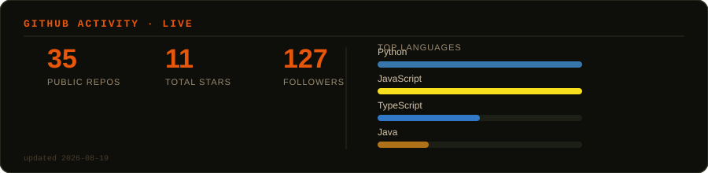

  

 

  
  &nbsp;
  
  &nbsp;
  
  &nbsp;
  
  &nbsp;
  

 

  

 

---

## 🛠️ Tech Arsenal

### 💻 Full Stack Development

### 🤖 AI / ML & Data

### ⛓️ Blockchain

### ☁️ Infra & Tools

 

---

## 🚀 Featured Projects

<table>
  <tr>
    <td width="50%">
      <h3 align="center">💹 Trading App</h3>
      

        
      

      
AI-powered stock prediction platform with a 42-feature ML ensemble, real-time NSE/BSE signals, portfolio tracking & paper trading — built for a YES Securities internship.

      

        
        
        
      

    </td>
    <td width="50%">
      <h3 align="center">🧠 CodeGraph Intelligence</h3>
      

        
      

      
AI-native code retrieval engine — a codebase modeled as an entity/edge graph in DuckDB with a 9-language parsing pipeline and hybrid ranking, cutting agent context usage ~9.6x.

      

        
        
        
      

    </td>
  </tr>
  <tr>
    <td width="50%">
      <h3 align="center">🖥️ System Design Simulator</h3>
      

        
      

      
Real-time distributed system observability with chaos injection, Z-score anomaly detection, cascade failure detection & Slack alerts.

      

        
        
        
      

    </td>
    <td width="50%">
      <h3 align="center">🏙️ CityFlow</h3>
      

        
      

      
Urban mobility analytics platform — interactive 3D city simulation with real-time KPI dashboards, demand allocation & anomaly detection across zones.

      

        
        
        
      

    </td>
  </tr>
  <tr>
    <td width="50%">
      <h3 align="center">🤖 Autonomous Agent Marketplace</h3>
      

        
      

      
Decentralized AI agent marketplace with on-chain escrow, verifiable off-chain execution & a task management dashboard.

      

        
        
        
      

    </td>
    <td width="50%">
      <h3 align="center">🌾 Fertilizer Subsidy Platform</h3>
      

        
      

      
Blockchain-based platform for transparent fertilizer subsidy distribution — farmers redeem subsidies via MetaMask with a fully auditable transaction trail.

      

        
        
        
      

    </td>
  </tr>
</table>

 

---

## 🧭 Career Journey

  

 

---

## 🏆 Achievements

<table>
  <tr>
    <td width="60">🥇</td>
    <td>
      <b>Winner — Global Hyperloop Competition</b> (Asia's First), IIT Madras · 2025 
      Secured six awards across engineering, design & technical presentation, representing VIT Vellore.
    </td>
  </tr>
  <tr>
    <td width="60">🎯</td>
    <td>
      <b>National Semi-Finalist — Flipkart GRiD 7.0</b> · 2025 
      Advanced to national semi-finals in a highly competitive software engineering challenge.
    </td>
  </tr>
</table>

 

---

## 📊 GitHub Activity

  
   
  <i>refreshed automatically every 6 hours via GitHub Actions</i>

 

---

  <i>⚡ "I build systems, not just applications."</i>

 
